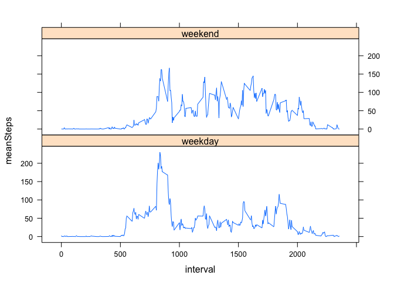

# Reproducible Research: Peer Assessment 1

## 1. Loading and preprocessing the data
### 1.1. load
Here the original file is unzipped as the first step.  This ensures that the data has not been modified before processing.

```r
unzip("./activity.zip")
activity_data <- read.csv("./activity.csv")
```

### 1.2. preprocessing
Here the activity data is summarised to calculate the total steps by date.
The [Split Apply Combine pattern is used with the plyr library](http://www.jstatsoft.org/v40/i01/)

```r
library(plyr)
x <- ddply(activity_data, .(date), summarize, dailySteps=sum(steps))
```
## 2. What is mean total number of steps taken per day?
### 2.1. Histogram

```r
   hist(x$dailySteps)
```

 

### 2.2. Calculate mean total number of steps taken per day

```r
mean(x$dailySteps, na.rm=TRUE)
```

```
## [1] 10766.19
```

```r
median(x$dailySteps, na.rm=TRUE)
```

```
## [1] 10765
```
## 3. What is the average daily activity pattern?
For this we need to remove NAs from the calculation. 
The number of intervals is checked using dim(ts)

```r
ts <- ddply(activity_data, .(interval), summarize, intSteps=mean(steps,na.rm=TRUE))
dim(ts)
```

```
## [1] 288   2
```
### 3.1 time series plot

```r
library(lattice)
xyplot(intSteps ~ interval, data = ts, type="l")
```

 

### 3.2 interval with the maximum number of steps
The output below shows that the maximum number of steps is 206 in interval 835.

```r
maxSteps <- ts[ts$intSteps == max(ts$intSteps),]
maxSteps
```

```
##     interval intSteps
## 104      835 206.1698
```


## 4. Imputing missing values
Explore the data a little, there should be 2304 NA values.  
Note that the first command below shows detailed data.  
This is included for information only.  See below for the counts required.

```r
countNAs <- count(activity_data[!complete.cases(activity_data),])
```
### 4.1. count and report the total number of missing values.
Calculate the NAs for each variable.  This demonstrates that the only variable
missing data is "steps".
The number of steps with NAs is 2304 as shown in the first of the three counts below.  

```r
count(is.na(activity_data$steps))
```

```
##       x  freq
## 1 FALSE 15264
## 2  TRUE  2304
```

```r
count(is.na(activity_data$date))
```

```
##       x  freq
## 1 FALSE 17568
```

```r
count(is.na(activity_data$interval))
```

```
##       x  freq
## 1 FALSE 17568
```
### 4.2. Devise a strategy for filling in the missing data
 I have chosen to use the average for the 5 minute interval.
This is chosen as it is a straight-forward approach to implement.

### 4.3. Create a new dataset with the missing data filled in (imputed)
Note the check in 4.1 shows that only step measurements are missing.

Impute the missing data.  
The ifelse function is 'vectorised'. We apply it to each interval group.  
Each interval group has 61 datum (dates).  
If there is an NA the mean number of steps is returned, otherwise the measured value 'steps'
is returned.

```r
imputed_data <- ddply(activity_data, .(interval), transform, intMean = ifelse(is.na(steps),mean(steps, na.rm=TRUE),steps))
```

Rearrange the data frame.  
Take only the columns we are intested in.  
Rename the column with the steps and step imputed values.

```r
imputed_df <- cbind(imputed_data[,2:4])
colnames(imputed_df)[3] <- "steps"
```
Change the order of the columns back to original order.  

```r
imputed_df <- imputed_df[,c(3,1,2)]
```

Summarize the imputed data suitable for histogram

```r
xImputed <- ddply(imputed_df, .(date), summarize, dailySteps=sum(steps))
```

### 4.4.1 Make a histogram
The below histogram is of the data with the missing data imputed.
That is with the missing data filled in.

```r
hist(xImputed$dailySteps)
```

 

### 4.4.2 Report the median and mean

```r
mean(xImputed$dailySteps)
```

```
## [1] 10766.19
```

```r
median(xImputed$dailySteps)
```

```
## [1] 10766.19
```

### 4.4.3 Do the values differ from part 1 ? 
The values do differ slightly from part 1.
The differences are summarised here:  
Part 1    
Mean    | 10766.19    
Median  | 10765      

Part 2    
Mean    | 10766.19  
Median  | 10766.19  


In part 2 the mean and median have the same value.  In part 1 there is a small difference.

### 4.4.5 What is the impact of imputing missing values?

The impact of imputing missing values has been to make the mean and the median have the
same value.

## 5. Are there differences in activity patterns between weekdays and weekends?
### 5.1. Create a new factor variable with two levels - weekday and weekend

```r
library(timeDate)
set_weekday_indicator <- function(x) {
    return (ifelse (isWeekday(x), "weekday", "weekend") )
}
factored_df <- ddply(imputed_df,.(date),transform, isWeekday = set_weekday_indicator(date))
summary(factored_df$isWeekday)
```

```
## weekday weekend 
##   12960    4608
```
Now make average steps by interval and weekday|weekend factor

```r
factored_avg_df <- ddply(factored_df,.(interval,isWeekday),summarize, meanSteps = mean(steps)) 
```

### 5.2 Make a panel plot
The panel plot below shows differences between the activities during weekdays and weekends.
The most obvious is that the subject does more steps (average) during the weekend than on
weekdays.  This is shown by the area under the plot, that is larger for weekends.

```r
library(lattice)
levels(factored_df$isWeekday) <- c('weekday','weekend')
xyplot(meanSteps ~ interval | isWeekday, data = factored_avg_df, type="l", layout=c(1,2))
```

 

### End of Report
